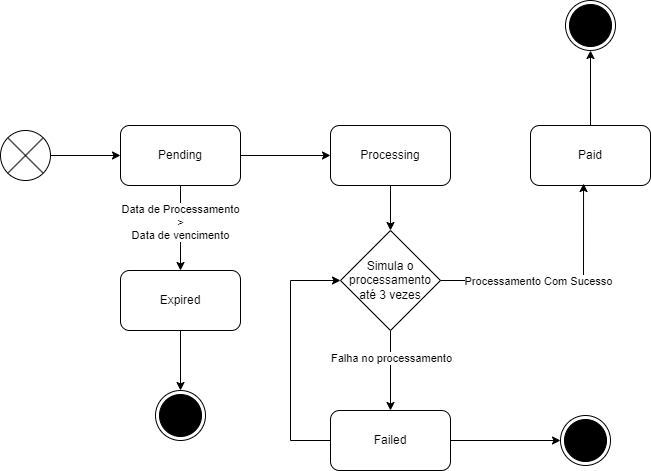

# Pedrosa Payments

## Índice

- [Pedrosa Payments](#pedrosa-payments)
  - [Índice](#índice)
  - [Objetivo](#objetivo)
  - [Desenvolvimento](#desenvolvimento)
    - [Tecnologia](#tecnologia)
    - [Instalação](#instalação)
      - [Parando container](#parando-container)
      - [Makefile](#makefile)
  - [Documentação da API](#documentação-da-api)

## Objetivo

O objetivo da aplicação é desenvolver uma API para criar pagamento e processá-lo.

Neste projeto foi utilizado o padrão de Clean Architecture, além de uns design patterns como Diagrama de Estado para controlar os status do pagamento.

### Diagrama de Estado



## Desenvolvimento

### Tecnologia

As tecnologias utilizadas no projeto:


| Categoria             	|                  	|                   	|          	|
|-----------------------	|------------------	|-------------------	|----------	|
| **Aplicação**             	| [PHP 8.3](https://www.php.net/)              	| [Laravel Framework 10](https://laravel.com/docs/10.x)             	|          	|
| **Banco de Dados**        	| [Mysql 8](https://dev.mysql.com/doc/relnotes/mysql/8.0/en/)            	|                   	|          	|
| **Testes**                	| [PHPUnit](https://phpunit.readthedocs.io/pt_BR/latest/)          	|   	|          	|
| **Análise de Código**     	| [PHP CodeSniffer](https://github.com/FriendsOfPHP/PHP-CS-Fixer) 	| [Larastan](https://github.com/nunomaduro/larastan) 	|  	| 
| **Desenvolvimento**       	| [Tinker](https://github.com/laravel/tinker)           	|                   	|          	|
| **Container**            	| [Docker](https://www.docker.com/)           	|                   	|          	|
| **Debug**            	| [Debugbar](https://github.com/barryvdh/laravel-debugbar)           	|                  	|          	|
| **API**             	| [OpenApi 3.0.3](https://swagger.io/specification/)              	|              	|          	|
| **Lint**        	| [Redoc OpenApi CLI](https://redocly.com/docs/cli/quickstart/)            	|                   	|          	|
| **Mock**                 	| [Prism](https://meta.stoplight.io/docs/prism/674b27b261c3c-overview)            	|                   	|          	|
| **Documentação**    	| [Redoc](https://github.com/Redocly/redoc)           	|                   	|          	|


### Instalação

- Baixar o projeto:

```
git clone git@github.com:pedrosalpr/pedrosa-payments.git
```

- Rodar o comando `make up` para subir container, caso não exista a imagem, ele já builda

- Rodar o comando `make install` para instalar os pacotes do composer

#### Parando container

Caso queira parar container basta executar `make down`.

#### Makefile

Existe arquivo chamado `Makefile` que facilita a execução de comandos. 

Para executar estes comandos basta executar `make [NOME_COMANDO]`.

> Existem vários comandos relacionado imagem, container, instalação de pacotes, análise estática, testes e logs.

> Para verificar sobre outros comandos do `make` basta olhar o arquivo `Makefile`.

### Testes

Os testes foram criados a partir da biblioteca [PHPUnit](https://phpunit.readthedocs.io/pt_BR/latest/).

Para executar os testes basta rodar o comando

```
make test
```

> Para um teste mais específico é recomandável entrar dentro do container através do comando de atalho `make bash` e rodar o teste com filtragem

## Documentação da API

A documentação da API se encontra dentro do diretório `doc`.

As especificações de openapi estão dentro do diretório `src`.

### Comandos

Os comandos no `package.json` para auxiliar tanto no desenvolvimento da documentação e do pessoal de frontend para consumir os mocks. 

#### Live

Este comando live monta uma preview da doc em tempo real, ou seja, qualquer alteração ele altera automaticamente.

```
npm run api-live
```

#### Lint

Este comando faz a parte do lint da documentação. Caso encontra algum erro, ele mostra aonde está ocorrendo o erro.

```
npm run api-lint
```

#### Build

Este comando gera a documentação estática da API.

```
npm run api-build
```

#### Mock

Este comando gera os mocks para serem testados.

```
npm run api-mock
```
